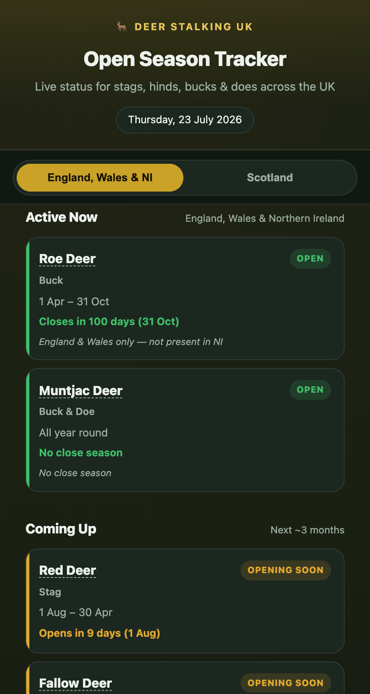
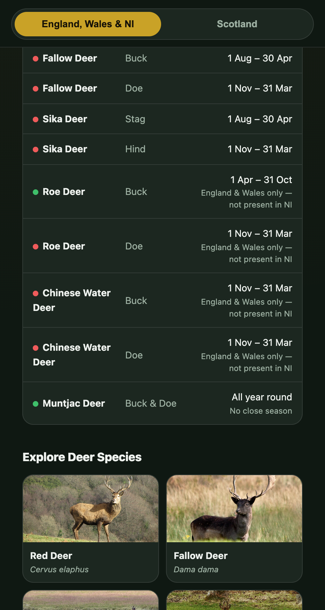
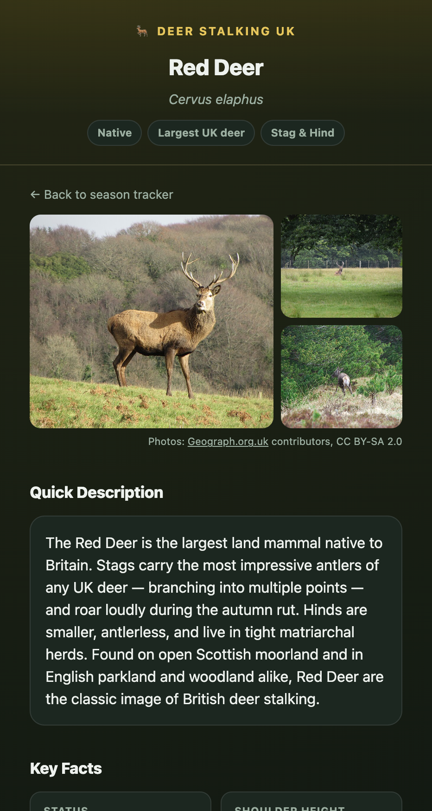

# UK Deer Stalking Seasons

<p align="center">
  
  
  
</p>

A mobile-first, static website that shows the current UK deer stalking open season, live, based on today's date — plus a reference guide for each of the six deer species found in the UK.

No build step, no backend, no dependencies — just static HTML, CSS and vanilla JS.

## Features

- **Live season status** — automatically calculates which species/sex are currently in their open season, based on the visitor's local date.
- **Region toggle** — switch between *England, Wales & Northern Ireland* and *Scotland*, since open season dates are devolved and differ between the two (including Scotland's 2023 abolition of the close season for male deer).
- **Active Now / Coming Up** — today's open seasons up top, with a countdown to seasons opening in the next ~3 months.
- **Full season reference table** — every species/sex/date range at a glance.
- **Species detail pages** — one page per species with a photo gallery, quick description, key facts (size, weight, lifespan, rut), stalking tips, and a longer write-up.
- **Official sources & legislation** — links out to gov.uk, NatureScot, DAERA, BASC, the British Deer Society, and the relevant Acts.

## Project structure

```
index.html                  Home page: live season tracker
red-deer.html                Species pages
fallow-deer.html
sika-deer.html
roe-deer.html
chinese-water-deer.html
muntjac-deer.html
css/styles.css              Shared stylesheet (dark/light theme via prefers-color-scheme)
images/<species>/1-3.jpg    Photos for each species' gallery
```

## Running locally

It's plain static HTML — open `index.html` directly in a browser, or serve the folder with any static file server, e.g.:

```bash
python3 -m http.server 8000
```

Then visit `http://localhost:8000`.

## Data sources

Season dates were cross-checked against:

- [BASC — Shooting seasons](https://basc.org.uk/shooting-seasons/)
- [NatureScot — Protected species: deer](https://www.nature.scot/professional-advice/protected-areas-and-species/protected-species/protected-species-z-guide/protected-species-deer)
- [British Deer Society — Deer close season](https://bds.org.uk/information-advice/about-deer/deer-close-season/)
- [Deer Act 1991](https://www.legislation.gov.uk/ukpga/1991/54/contents) / [Deer (Scotland) Act 1996](https://www.legislation.gov.uk/asp/1996/58/contents)

Species photos are from [Geograph.org.uk](https://www.geograph.org.uk) and Wikimedia Commons contributors, licensed CC BY-SA 2.0 (credited on each species page).

## Notes

- All season data is hardcoded in `index.html` — there's no API or database. Update the `EWNI` / `SCOT` arrays in the `<script>` block to change dates.
- This is a reference tool, not legal advice. Always confirm current law and required certification (DSC1/DSC2) with BASC or the British Deer Society before stalking.

## License

Code is licensed under the [MIT License](LICENSE). Species photos are separately licensed CC BY-SA 2.0 by their original authors (credited on each species page) and are not covered by the MIT license.
